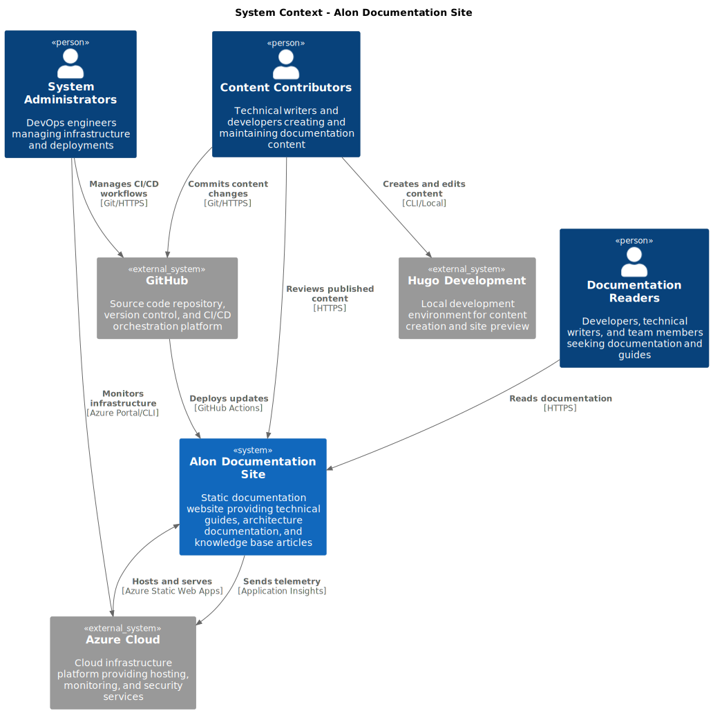

## System Context

The Alon Documentation Site is a modern, cloud-native documentation platform designed to serve technical documentation, guides, and knowledge base articles. Built with performance, scalability, and maintainability in mind, the system leverages static site generation and cloud infrastructure to deliver an optimal user experience.

## System Stakeholders

### Primary Users

- **Documentation Readers**: Developers, technical writers, and team members accessing documentation
- **Content Contributors**: Technical writers and developers creating and updating documentation
- **System Administrators**: DevOps engineers managing infrastructure and deployments

### External Systems

- **GitHub**: Source code repository and CI/CD orchestration platform
- **Azure Cloud**: Cloud infrastructure and hosting platform
- **Content Management**: Local development environments and content creation tools

## C4 Context Diagram

The following diagram illustrates the system context, showing how external actors interact with our documentation platform:

## System Boundaries

### Internal Systems

- **Documentation Website**: The primary static site serving documentation content
- **Build Pipeline**: Automated processes for content compilation and deployment
- **Infrastructure Management**: Terraform-managed Azure resources

### External Dependencies

- **GitHub Repository**: Source of truth for content and configuration
- **Azure Static Web Apps**: Hosting platform and CDN
- **Application Insights**: Monitoring and analytics service
- **Hugo Static Site Generator**: Content processing and site generation engine

## Core System Flows

### Content Publication Flow

1. **Content Creation**: Contributors write documentation using Markdown and Hugo features
2. **Version Control**: Changes are committed to GitHub repository
3. **Automated Build**: GitHub Actions triggers Hugo site generation
4. **Infrastructure Provisioning**: Terraform ensures Azure resources are available
5. **Deployment**: Built site is deployed to Azure Static Web Apps
6. **Monitoring**: Application Insights collects usage and performance data

### User Access Flow

1. **Content Discovery**: Users navigate to documentation site via web browser
2. **Content Delivery**: Azure Static Web Apps serves static content via global CDN
3. **Search & Navigation**: Users find relevant documentation through site navigation
4. **Feedback Loop**: Usage analytics help improve content and user experience

## System Objectives

### Primary Goals

- **Content Accessibility**: Provide fast, reliable access to technical documentation
- **Content Maintainability**: Enable easy updates and collaborative content creation
- **System Reliability**: Ensure high availability and performance
- **Security**: Maintain secure content delivery and infrastructure management

### Success Metrics

- **Performance**: Page load times under 2 seconds globally
- **Availability**: 99.9% uptime for documentation access
- **Content Freshness**: Updates published within 5 minutes of commit
- **User Experience**: Intuitive navigation and search functionality

## Key System Characteristics

### Scalability

- **Global Distribution**: Content delivered via Azure CDN worldwide
- **Auto-scaling**: Serverless hosting automatically handles traffic spikes
- **Caching Strategy**: Multiple layers of caching optimize performance

### Security

- **HTTPS Enforcement**: All content delivered over secure connections
- **OIDC Authentication**: Secure GitHub-to-Azure deployment pipeline
- **Access Control**: Infrastructure protected by Azure AD and RBAC

### Maintainability

- **Infrastructure as Code**: All resources defined and versioned in Terraform
- **Automated Deployments**: Zero-touch deployments via GitHub Actions
- **Monitoring**: Comprehensive telemetry and alerting via Application Insights

## Technology Advantages

The chosen technology stack provides several key advantages:

- **Static Site Generation**: Enhanced security, performance, and simplicity
- **Cloud-Native Architecture**: Scalability, reliability, and cost-effectiveness
- **DevOps Integration**: Automated workflows reduce manual operations
- **Modern Web Standards**: Progressive enhancement and accessibility features
- **Open Source Ecosystem**: Leverages proven, community-supported technologies
