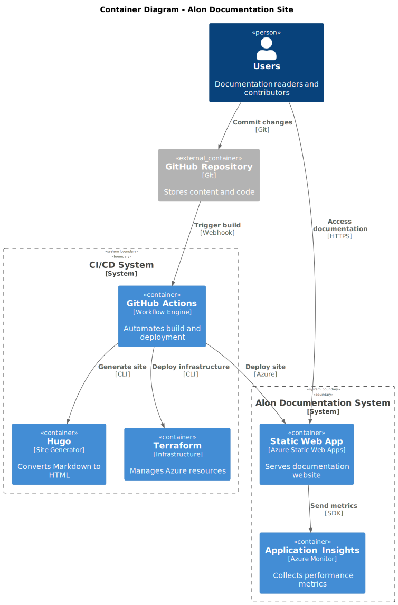

## Container Architecture Overview

The C4 Container diagram provides a detailed view of the Alon Documentation Site's internal architecture. This level shows the major containers (applications, databases, microservices, etc.) that make up the system and how they interact with each other and external systems.

## 🏗️ Container Responsibilities

### Content Processing Containers

- **Hugo Site Generator**: Transforms Markdown content into optimized static HTML
- **GitHub Actions Workflow**: Orchestrates build, test, and deployment processes
- **Terraform Engine**: Manages infrastructure provisioning and updates

### Runtime Containers

- **Azure Static Web App**: Serves static content with global CDN distribution
- **Application Insights**: Collects and analyzes telemetry data
- **GitHub Repository**: Stores source code, content, and configuration

## 📊 C4 Container Diagram

The following diagram illustrates the container-level architecture with detailed component interactions:

## Container Details

### Static Web App

- **Purpose**: Hosts the documentation website
- **Technology**: Azure Static Web Apps
- **Features**: Global CDN, HTTPS, custom domains

### Application Insights

- **Purpose**: Monitors site performance and usage
- **Technology**: Azure Monitor
- **Features**: Real-time metrics, alerts, analytics

### GitHub Actions

- **Purpose**: Automates build and deployment
- **Technology**: CI/CD workflows
- **Features**: Event-driven, secure, parallel execution

### Hugo

- **Purpose**: Generates static site from Markdown
- **Technology**: Static site generator
- **Features**: Fast builds, themes, SEO optimization

### Terraform

- **Purpose**: Manages Azure infrastructure
- **Technology**: Infrastructure as Code
- **Features**: Declarative, versioned, consistent

### GitHub Repository

- **Purpose**: Stores all source code and content
- **Technology**: Git version control
- **Features**: Collaboration, history, branching

## Container Interactions

### Build and Deployment Flow

1. **Content Update**: Contributors push changes to GitHub Repository
2. **Workflow Trigger**: GitHub Actions detects changes and starts workflow
3. **Infrastructure Check**: Terraform validates and applies infrastructure changes
4. **Site Generation**: Hugo processes content and generates static site
5. **Deployment**: GitHub Actions deploys generated site to Azure Static Web App
6. **Monitoring**: Application Insights begins collecting telemetry from live site

### Runtime Interactions

1. **User Request**: Reader requests documentation page via browser
2. **Content Delivery**: Azure Static Web App serves content via CDN
3. **Telemetry Collection**: Application Insights captures user interaction data
4. **Performance Monitoring**: Continuous monitoring of site performance and availability

## Security Considerations

### Authentication & Authorization

- **OIDC Federated Credentials**: Secure, token-based authentication between GitHub Actions and Azure
- **Service Principal**: Terraform uses dedicated service principal with minimal required permissions
- **Azure AD Integration**: All Azure services authenticate via Azure Active Directory

### Data Protection

- **HTTPS Everywhere**: All communications encrypted in transit
- **Content Security**: Static content served from secure Azure infrastructure
- **Secret Management**: Sensitive configuration stored in GitHub Secrets and Azure Key Vault

## Performance Characteristics

### Scalability

- **Auto-scaling**: Azure Static Web Apps automatically handle traffic spikes
- **Global Distribution**: CDN ensures low latency worldwide
- **Serverless Architecture**: Pay-per-use model with unlimited scalability

### Reliability

- **High Availability**: 99.9% SLA from Azure Static Web Apps
- **Redundancy**: Multi-region CDN distribution
- **Disaster Recovery**: Infrastructure as Code enables rapid recovery

### Performance

- **Fast Builds**: Hugo generates sites in seconds
- **Optimized Delivery**: CDN caching and compression
- **Minimal Dependencies**: Static sites load faster than dynamic alternatives
