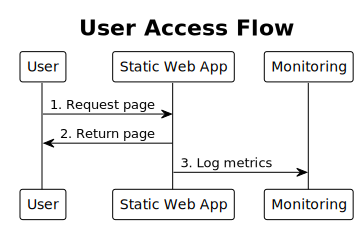

## Technology Stack Overview

The Alon Documentation Site leverages a carefully selected technology stack that provides optimal performance, security, and maintainability. Each technology plays a specific role in the overall architecture, with well-defined interactions and dependencies.

## 🔧 Core Technology Roles

### Hugo Static Site Generator

**Primary Role**: Content Processing and Site Generation
**Technology Version**: Hugo Extended (Latest Stable)
**Key Responsibilities**:

- Transform Markdown content into optimized HTML pages
- Apply responsive themes and layouts
- Process and optimize static assets (CSS, JS, images)
- Generate SEO-friendly URLs and metadata
- Create RSS feeds and sitemaps

**Integration Points**:

- **Input Sources**: Git repository content, configuration files, themes
- **Output Targets**: Static file artifacts for deployment
- **Configuration**: TOML/YAML configuration files
- **Extensions**: Custom shortcodes and plugins

### Azure Static Web Apps

**Primary Role**: Hosting and Content Delivery
**Service Tier**: Standard Tier
**Key Responsibilities**:

- Serve static HTML, CSS, and JavaScript files
- Provide global CDN distribution
- Handle SSL certificate management
- Manage custom domain configuration
- Enable staging environments for pull requests

**Integration Points**:

- **Content Source**: Deployed static files from GitHub Actions
- **Monitoring Target**: Application Insights telemetry collection
- **Security**: Azure AD integration for authentication
- **Networking**: Azure CDN for global content distribution

### Application Insights

**Primary Role**: Monitoring and Telemetry
**Service Type**: Azure Monitor Application Insights
**Key Responsibilities**:

- Collect application performance metrics
- Track user interactions and page views
- Monitor application availability and health
- Provide alerting and diagnostic capabilities
- Generate usage analytics and insights

**Integration Points**:

- **Data Sources**: Azure Static Web Apps, client-side JavaScript
- **Configuration**: Connection strings and instrumentation keys
- **Alerting**: Azure Monitor alerts and action groups
- **Analytics**: Custom KQL queries and dashboards

### Terraform

**Primary Role**: Infrastructure as Code
**Version**: Terraform >= 1.0
**Key Responsibilities**:

- Define Azure infrastructure resources declaratively
- Manage resource lifecycle and dependencies
- Maintain infrastructure state consistency
- Enable infrastructure versioning and rollbacks
- Ensure consistent resource naming and tagging

**Integration Points**:

- **Target Platform**: Azure Resource Manager (ARM)
- **State Storage**: Remote state backend (Azure Storage)
- **Variable Sources**: Environment variables, .tfvars files
- **Execution Context**: GitHub Actions runners

### GitHub Actions

**Primary Role**: CI/CD Automation
**Runtime Environment**: Ubuntu Latest
**Key Responsibilities**:

- Orchestrate build and deployment workflows
- Execute Hugo site generation
- Run Terraform infrastructure management
- Deploy generated site to Azure Static Web Apps
- Manage secrets and environment variables

**Integration Points**:

- **Trigger Sources**: Git repository events (push, PR)
- **Execution Environment**: GitHub-hosted runners
- **Secret Management**: GitHub Secrets and Azure Key Vault
- **Deployment Targets**: Azure services via OIDC authentication

### OIDC Federated Credential

**Primary Role**: Secure Authentication
**Protocol**: OpenID Connect
**Key Responsibilities**:

- Enable secure, token-based authentication
- Eliminate long-lived secrets in CI/CD pipelines
- Provide fine-grained access control
- Support temporary credential issuance
- Enable audit trail for authentication events

**Integration Points**:

- **Identity Provider**: GitHub Actions OIDC token issuer
- **Relying Party**: Azure Active Directory
- **Scope**: Specific repository and environment access
- **Token Lifetime**: Short-lived tokens for secure operations

## Technology Interaction Flows

### Content Publication Flow


### User Access Flow



## Integration Patterns

### Event-Driven Integration

**Pattern**: GitHub webhook triggers initiate automated workflows
**Technologies**: GitHub Repository → GitHub Actions
**Benefits**:

- Immediate response to code changes
- Decoupled system components
- Scalable event processing

**Implementation**:

```yaml
on:
  push:
    branches: [main]
  pull_request:
    branches: [main]
```

### Infrastructure as Code Integration

**Pattern**: Declarative infrastructure management
**Technologies**: Terraform → Azure Resource Manager
**Benefits**:

- Consistent infrastructure provisioning
- Version-controlled infrastructure changes
- Automated resource lifecycle management

**Implementation**:

```hcl
resource "azurerm_static_web_app" "this" {
  name                = local.static_app_name
  location            = data.azurerm_resource_group.existing.location
  resource_group_name = data.azurerm_resource_group.existing.name
  sku_size            = "Standard"
  sku_tier            = "Standard"

  app_settings = {
    "APPINSIGHTS_INSTRUMENTATIONKEY" = azurerm_application_insights.this.instrumentation_key
    "APPLICATIONINSIGHTS_CONNECTION_STRING" = azurerm_application_insights.this.connection_string
  }
}
```

### Secure Authentication Integration

**Pattern**: OIDC federated credential authentication
**Technologies**: GitHub Actions → Azure Active Directory
**Benefits**:

- No long-lived secrets required
- Fine-grained access control
- Comprehensive audit trail

**Implementation**:

```yaml
permissions:
  id-token: write
  contents: read

steps:
  - name: Azure Login
    uses: azure/login@v1
    with:
      client-id: ${{ secrets.AZURE_CLIENT_ID }}
      tenant-id: ${{ secrets.AZURE_TENANT_ID }}
      subscription-id: ${{ secrets.AZURE_SUBSCRIPTION_ID }}
```

### Monitoring Integration

**Pattern**: Comprehensive telemetry collection
**Technologies**: Azure Static Web Apps → Application Insights
**Benefits**:

- Real-time performance monitoring
- User behavior analytics
- Proactive issue detection

**Implementation**:

```javascript
appInsights.loadAppInsights({
  config: {
    instrumentationKey: "your-instrumentation-key",
    enableAutoRouteTracking: true,
    enableCorsCorrelation: true
  }
});
```

## Data Flow Architecture

### Content Data Flow

1. **Source**: Markdown files in Git repository
2. **Processing**: Hugo transforms content to HTML
3. **Optimization**: Assets are processed and optimized
4. **Delivery**: Static files served via Azure CDN
5. **Analytics**: User interactions tracked by Application Insights

### Configuration Data Flow

1. **Source**: Configuration files in Git repository
2. **Environment**: GitHub Secrets provide sensitive values
3. **Infrastructure**: Terraform variables define resources
4. **Application**: Hugo configuration controls site generation
5. **Runtime**: Azure App Settings configure deployed application

### Telemetry Data Flow

1. **Collection**: Client and server-side data collection
2. **Transmission**: Data sent to Application Insights
3. **Processing**: Azure Monitor processes telemetry
4. **Storage**: Processed data stored in Log Analytics
5. **Analysis**: KQL queries provide insights and alerts

## Security Integration Patterns

### Identity and Access Management

- **Azure AD Integration**: Centralized identity management
- **RBAC**: Role-based access control for Azure resources
- **Service Principals**: Dedicated identities for automation
- **OIDC Federation**: Secure, temporary credential issuance

### Network Security

- **HTTPS Enforcement**: All communications encrypted in transit
- **CDN Security**: Azure CDN provides DDoS protection
- **Content Security Policy**: Client-side security headers
- **Azure Security Center**: Continuous security monitoring

### Secrets Management

- **GitHub Secrets**: Secure storage of CI/CD credentials
- **Azure Key Vault**: Centralized secret management
- **Environment Variables**: Runtime configuration management
- **Credential Rotation**: Automated credential lifecycle management

## Performance Optimization Patterns

### Caching Strategies

- **CDN Caching**: Global edge caching for static content
- **Browser Caching**: Client-side caching with cache headers
- **Build Caching**: GitHub Actions cache for faster builds
- **Asset Fingerprinting**: Hugo asset optimization and caching

### Content Optimization

- **Static Generation**: Pre-built HTML for fast delivery
- **Image Optimization**: Automatic image resizing and compression
- **Asset Bundling**: Concatenation and minification of CSS/JS
- **Progressive Enhancement**: Core content loads first

### Infrastructure Optimization

- **Auto-scaling**: Serverless scaling based on demand
- **Global Distribution**: Multi-region CDN distribution
- **Resource Optimization**: Right-sized Azure resources
- **Performance Monitoring**: Continuous optimization based on metrics

## Technology Evolution Strategy

### Upgrade Patterns

- **Hugo Updates**: Regular updates to latest stable version
- **Azure Service Updates**: Automatic platform improvements
- **Terraform Provider Updates**: Keep providers current
- **Security Patches**: Automated dependency updates

### Scalability Considerations

- **Horizontal Scaling**: Serverless architecture enables unlimited scaling
- **Content Scaling**: CDN handles global content distribution
- **Build Scaling**: Parallel job execution in GitHub Actions
- **Monitoring Scaling**: Application Insights auto-scales with usage

### Technology Roadmap

- **Progressive Web App**: Enhanced offline capabilities
- **Advanced Analytics**: Machine learning insights
- **Multi-tenancy**: Support for multiple documentation sites
- **API Integration**: Headless CMS capabilities
