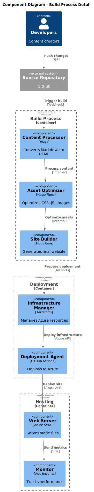

## Component Architecture Overview

The C4 Component diagram provides the most detailed architectural view, showing the internal components within containers, their responsibilities, and how they interact with each other. This level is particularly useful for developers who need to understand the implementation details and component dependencies.

## 🧩 Component Categories

### Content Processing Components

- **Content Parser**: Processes Markdown files and extracts metadata
- **Theme Engine**: Applies Hugo themes and layouts
- **Asset Optimizer**: Optimizes images, CSS, and JavaScript
- **Site Generator**: Orchestrates the build process

### Infrastructure Components

- **Resource Manager**: Manages Azure resource definitions
- **State Manager**: Handles Terraform state operations
- **Configuration Manager**: Manages environment-specific settings
- **Deployment Controller**: Coordinates resource provisioning

### Monitoring Components

- **Telemetry Collector**: Gathers application metrics
- **Log Aggregator**: Processes and stores log data
- **Alert Manager**: Handles monitoring alerts and notifications
- **Analytics Engine**: Processes usage analytics

## 📊 C4 Component Diagram

The following diagram shows the detailed component-level architecture:

## Detailed Component Analysis

### Hugo Static Site Generator Components

#### Content Parser

**Technology**: Go/Hugo Core Engine
**Responsibilities**:

- Parses Markdown files and extracts frontmatter metadata
- Validates content structure and format
- Processes taxonomies and content organization
- Handles multi-language content detection

**Interfaces**:

- **Input**: Raw Markdown files from Git repository
- **Output**: Parsed content objects with metadata
- **Configuration**: Hugo configuration files (hugo.toml)

#### Theme Engine

**Technology**: Go Templates
**Responsibilities**:

- Applies layout templates to parsed content
- Processes partial templates and includes
- Manages template inheritance and overrides
- Handles responsive design and accessibility features

**Interfaces**:

- **Input**: Parsed content objects and theme templates
- **Output**: HTML pages with applied styling
- **Configuration**: Theme configuration and customizations

#### Asset Pipeline

**Technology**: Hugo Pipes
**Responsibilities**:

- Compiles SCSS to optimized CSS
- Bundles and minifies JavaScript files
- Optimizes and resizes images
- Manages asset fingerprinting for cache busting

**Interfaces**:

- **Input**: Raw SCSS, JS, and image files
- **Output**: Optimized, production-ready assets
- **Configuration**: Asset processing parameters

### GitHub Actions Workflow Components

#### Workflow Engine

**Technology**: GitHub Actions Runtime
**Responsibilities**:

- Orchestrates CI/CD pipeline execution
- Manages workflow triggers and events
- Coordinates parallel and sequential job execution
- Handles workflow state and error recovery

**Interfaces**:

- **Input**: Workflow YAML definitions and trigger events
- **Output**: Job execution commands and status updates
- **Configuration**: Workflow configuration files

#### Build Runner

**Technology**: Ubuntu Virtual Machine
**Responsibilities**:

- Executes build and deployment commands
- Manages software dependencies and tools
- Provides isolated execution environment
- Handles artifact generation and storage

**Interfaces**:

- **Input**: Job definitions and execution commands
- **Output**: Build artifacts and execution logs
- **Configuration**: Runner specifications and software versions

### Terraform Infrastructure Components

#### Resource Manager

**Technology**: HashiCorp Configuration Language (HCL)
**Responsibilities**:

- Defines Azure resource configurations declaratively
- Manages resource dependencies and relationships
- Handles resource lifecycle operations
- Ensures consistent resource naming and tagging

**Interfaces**:

- **Input**: Terraform configuration files (.tf)
- **Output**: Resource deployment plans
- **Configuration**: Variable definitions and environment settings

#### State Manager

**Technology**: Terraform State Engine
**Responsibilities**:

- Tracks current infrastructure state
- Manages state file operations and locking
- Handles state migration and backup
- Enables collaborative infrastructure management

**Interfaces**:

- **Input**: Current infrastructure state and planned changes
- **Output**: Updated state information
- **Configuration**: Backend configuration for state storage

## Component Interaction Patterns

### Build Process Flow

1. **Content Ingestion**: Content Parser reads and validates Markdown files
2. **Template Processing**: Theme Engine applies layouts and templates
3. **Asset Optimization**: Asset Pipeline processes and optimizes static assets
4. **Site Generation**: Site Generator orchestrates final HTML generation
5. **Artifact Creation**: Build artifacts are packaged for deployment

### Infrastructure Provisioning Flow

1. **Configuration Loading**: Variable Manager loads environment-specific values
2. **Resource Planning**: Resource Manager creates deployment plan
3. **State Management**: State Manager tracks infrastructure changes
4. **Resource Provisioning**: Provider Manager executes Azure resource creation
5. **Configuration Updates**: Resources are configured with application settings

### Monitoring and Observability Flow

1. **Data Collection**: Telemetry Collector gathers performance metrics
2. **Log Processing**: Log Aggregator processes and stores application logs
3. **Analytics Processing**: Analytics Engine generates insights from collected data
4. **Alert Evaluation**: Alert Manager evaluates threshold violations
5. **Notification Delivery**: Alerts are delivered to configured channels

## Component Performance Characteristics

### Scalability Patterns

- **Stateless Components**: All components are designed to be stateless for horizontal scaling
- **Event-Driven Architecture**: Components communicate through events and message passing
- **Caching Strategies**: Multiple layers of caching optimize component performance

### Reliability Patterns

- **Circuit Breaker**: Components implement failure isolation mechanisms
- **Retry Logic**: Transient failures are handled with exponential backoff
- **Health Checks**: Components expose health endpoints for monitoring

### Security Patterns

- **Least Privilege**: Components operate with minimal required permissions
- **Input Validation**: All external inputs are validated and sanitized
- **Secure Communication**: Inter-component communication uses encrypted channels
