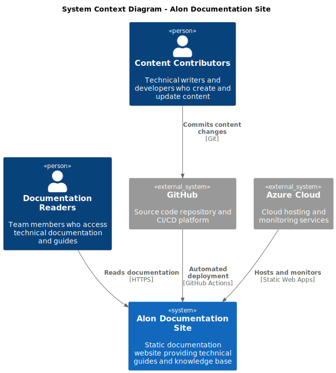

## Context Diagram Overview

The C4 Context diagram provides the highest level view of the Alon Documentation Site, showing how it fits into the broader organizational and technical ecosystem. This diagram illustrates the system's external interfaces, key stakeholders, and the boundary between our system and external dependencies.

## External Actors

### Human Users

- **Documentation Readers**: End users consuming technical documentation, guides, and knowledge base articles
- **Content Contributors**: Technical writers, developers, and subject matter experts creating and maintaining content
- **System Administrators**: DevOps engineers and platform administrators managing the infrastructure and deployment processes

### External Systems

- **GitHub Platform**: Provides source control, collaboration features, and CI/CD orchestration
- **Azure Cloud Platform**: Delivers hosting infrastructure, monitoring services, and security capabilities
- **Development Tools**: Local development environments, editors, and content creation tools

## 🏛️ C4 Context Diagram

The following diagram shows the system context and external relationships:

## System Boundary Definition

### Internal System Scope

The **Alon Documentation Site** encompasses:

- Static documentation website with search and navigation
- Content rendering and site generation
- Basic analytics and monitoring

### External System Dependencies

**GitHub**:

- Source code and content storage
- Version control and collaboration
- Automated CI/CD pipeline

**Azure Cloud**:

- Web hosting and global delivery
- Application monitoring
- Security and authentication

## Key Context Relationships

### Content Flow

1. **Contributors** create content locally and push to **GitHub**
2. **GitHub** automatically builds and deploys to **Azure**
3. **Azure** hosts the site and provides monitoring
4. **Readers** access the documentation via web browser

## Context-Level Business Goals

### Primary Objectives

- **Knowledge Accessibility**: Provide fast, reliable access to organizational knowledge
- **Content Quality**: Maintain high-quality, up-to-date technical documentation
- **Developer Experience**: Enable efficient content creation and collaboration workflows
- **System Reliability**: Ensure consistent availability and performance

### Success Criteria

- **User Satisfaction**: High user engagement and positive feedback
- **Content Freshness**: Regular updates and accurate information
- **System Performance**: Fast loading times and minimal downtime
- **Operational Efficiency**: Streamlined content management processes

## External System Characteristics

### GitHub Platform Integration

**Relationship Type**: Primary Development Platform
**Communication Patterns**:

- Webhook-driven event notifications
- API-based resource management
- Git protocol for content synchronization
- HTTPS for web-based interactions

**Dependencies**:

- Repository availability for content updates
- Actions runner availability for deployments
- API rate limits and service quotas
- Network connectivity and authentication

### Azure Cloud Platform Integration

**Relationship Type**: Primary Infrastructure Provider
**Communication Patterns**:

- Resource Manager API for infrastructure operations
- HTTPS for content delivery and monitoring
- Azure AD for authentication and authorization
- Service-to-service communication within Azure

**Dependencies**:

- Service availability across multiple Azure regions
- Authentication service reliability
- Network connectivity and bandwidth
- Service limits and quotas

### Development Tools Integration

**Relationship Type**: Content Creation Environment
**Communication Patterns**:

- Local file system operations
- Git protocol for version control
- HTTP for local preview and testing
- Command-line interface interactions

**Dependencies**:

- Local development environment setup
- Tool compatibility and versions
- Network access for synchronization
- User expertise and training

## Context-Level Non-Functional Requirements

### Performance Requirements

- **Response Time**: Pages load within 2 seconds globally
- **Throughput**: Support 1000+ concurrent users
- **Availability**: 99.9% uptime excluding planned maintenance
- **Scalability**: Auto-scale based on traffic patterns

### Security Requirements

- **Authentication**: Secure access to administrative functions
- **Authorization**: Role-based access control for different user types
- **Data Protection**: Encryption in transit and at rest
- **Compliance**: Adherence to organizational security policies

### Operational Requirements

- **Monitoring**: Comprehensive observability and alerting
- **Backup**: Regular backup of content and configuration
- **Recovery**: Disaster recovery procedures and testing
- **Maintenance**: Planned maintenance windows and notifications

## Context Evolution Strategy

### Future External System Integration

- **Content Management Systems**: Potential integration with headless CMS
- **Analytics Platforms**: Enhanced user behavior analytics
- **Search Services**: Advanced search capabilities
- **Collaboration Tools**: Integration with team communication platforms

### Scalability Considerations

- **Multi-region Deployment**: Global content delivery optimization
- **API Gateway**: Centralized API management for external integrations
- **Microservices Architecture**: Potential decomposition for specific features
- **Event-Driven Architecture**: Enhanced system decoupling and resilience
