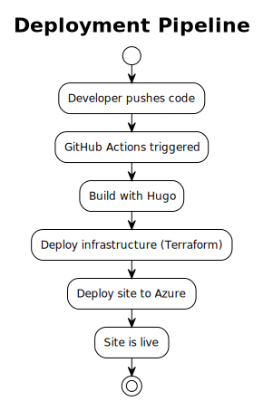

## Deployment Architecture Overview

The Alon Documentation Site employs a modern, automated deployment architecture that ensures reliable, secure, and efficient delivery of documentation updates. The deployment strategy follows Infrastructure as Code principles and implements comprehensive CI/CD practices for both application and infrastructure management.

## Deployment Strategy

### Core Principles

- **Infrastructure as Code**: All infrastructure defined and versioned in code
- **Immutable Deployments**: New deployments replace previous versions entirely
- **Zero-Downtime Deployments**: Seamless updates without service interruption
- **Automated Testing**: Comprehensive validation before production deployment
- **Rollback Capability**: Quick rollback to previous stable versions

### Deployment Environments

- **Development**: Local development environment with Hugo dev server
- **Staging**: Pull request preview environments in Azure Static Web Apps
- **Production**: Live documentation site served to end users

## CI/CD Pipeline Architecture

### Pipeline Overview



### GitHub Actions Workflow Structure

#### Workflow Triggers

```yaml
on:
  push:
    branches: [main]
    paths:
      - "content/**"
      - "static/**"
      - "config/**"
      - "layouts/**"
      - "infra/**"
  pull_request:
    branches: [main]
    paths:
      - "content/**"
      - "static/**"
      - "config/**"
      - "layouts/**"
  workflow_dispatch:
    inputs:
      environment:
        description: "Deployment environment"
        required: true
        default: "production"
```

#### Workflow Jobs Architecture

**1. Infrastructure Job**

- **Purpose**: Manage Azure infrastructure resources
- **Dependencies**: None (runs first)
- **Tools**: Terraform, Azure CLI
- **Duration**: 2-5 minutes

**2. Build Job**

- **Purpose**: Generate static site and optimize assets
- **Dependencies**: Infrastructure job (for production deployments)
- **Tools**: Hugo, Node.js, npm/yarn
- **Duration**: 1-3 minutes

**3. Test Job**

- **Purpose**: Validate build output and content quality
- **Dependencies**: Build job
- **Tools**: HTML Proofer, Lighthouse CI, custom validators
- **Duration**: 2-4 minutes

**4. Deploy Job**

- **Purpose**: Deploy generated site to Azure Static Web Apps
- **Dependencies**: Test job (must pass)
- **Tools**: Azure CLI, Azure Static Web Apps CLI
- **Duration**: 1-2 minutes

**5. Post-Deploy Job**

- **Purpose**: Verify deployment and configure monitoring
- **Dependencies**: Deploy job
- **Tools**: curl, Azure CLI, custom health check scripts
- **Duration**: 1-2 minutes

## Infrastructure Provisioning

### Terraform Configuration Structure

#### Provider Configuration

```hcl
terraform {
  required_version = ">= 1.0"
  required_providers {
    azurerm = {
      source  = "hashicorp/azurerm"
      version = "~> 3.80"
    }
  }
  backend "azurerm" {
    resource_group_name  = "terraform-state-rg"
    storage_account_name = "terraformstatestorage"
    container_name       = "tfstate"
    key                  = "alon-docs.terraform.tfstate"
  }
}

provider "azurerm" {
  features {}
  use_oidc = true
}
```

#### Resource Dependencies


### Infrastructure Deployment Process

#### 1. State Management

- **Remote State**: Stored in Azure Storage Account
- **State Locking**: Prevents concurrent modifications
- **State Backup**: Automatic versioning and backup
- **State Migration**: Supports infrastructure evolution

#### 2. Resource Naming Convention

```hcl
locals {
  location_map = jsondecode(file("${path.root}/location.json"))
  abbreviation_map = jsondecode(file("${path.root}/abbreviations.json"))

  name_with_dashes = "${var.app_name}-${local.location_map[data.azurerm_resource_group.existing.location].alias}-${lower(substr(var.environment_name, 0, 1))}-"

  static_app_name = "${local.name_with_dashes}${local.abbreviation_map.webStaticSites}"
  app_insight_name = "${local.name_with_dashes}${local.abbreviation_map.insightsComponents}"
}
```

#### 3. Resource Configuration

- **Tagging Strategy**: Consistent tagging for cost management and organization
- **Environment Separation**: Environment-specific configurations
- **Security Configuration**: Minimal required permissions and network restrictions
- **Monitoring Integration**: Automatic Application Insights configuration

## Deployment Strategies

### Production Deployment Strategy

#### Blue-Green Deployment Simulation

While Azure Static Web Apps doesn't support traditional blue-green deployments, we simulate this pattern:

1. **Staging Slot**: New version deployed to staging slot
2. **Validation**: Automated and manual testing in staging
3. **Slot Swap**: Instant promotion to production
4. **Rollback**: Quick rollback by swapping slots again

#### Deployment Phases

**Phase 1: Pre-Deployment**

- Infrastructure validation and updates
- Dependency checks and security scans
- Build artifact generation and validation

**Phase 2: Deployment**

- Static file upload to Azure Storage
- CDN cache invalidation
- Configuration updates
- DNS propagation (if needed)

**Phase 3: Post-Deployment**

- Health check validation
- Performance baseline establishment
- Monitoring configuration
- User acceptance notification

### Preview Deployment Strategy

#### Pull Request Previews

```yaml
- name: Deploy to Preview
  if: github.event_name == 'pull_request'
  uses: Azure/static-web-apps-deploy@v1
  with:
    azure_static_web_apps_api_token: ${{ secrets.AZURE_STATIC_WEB_APPS_API_TOKEN }}
    repo_token: ${{ secrets.GITHUB_TOKEN }}
    action: "upload"
    app_location: "/public"
    api_location: ""
    output_location: ""
    deployment_environment: "preview-${{ github.event.number }}"
```

#### Preview Environment Features

- **Unique URLs**: Each PR gets a unique preview URL
- **Automatic Cleanup**: Preview environments cleaned up when PR is closed
- **Full Functionality**: Complete site functionality in preview
- **Access Control**: Optional authentication for sensitive previews

## Security in Deployment

### Authentication and Authorization

#### OIDC Federated Credentials

```yaml
permissions:
  id-token: write
  contents: read

steps:
  - name: Azure Login
    uses: azure/login@v1
    with:
      client-id: ${{ secrets.AZURE_CLIENT_ID }}
      tenant-id: ${{ secrets.AZURE_TENANT_ID }}
      subscription-id: ${{ secrets.AZURE_SUBSCRIPTION_ID }}
```

#### Secret Management

- **GitHub Secrets**: Store sensitive deployment credentials
- **Azure Key Vault**: Centralized secret management for Azure resources
- **Environment Variables**: Runtime configuration without hardcoded values
- **Credential Rotation**: Regular rotation of authentication credentials

### Security Validations

- **Infrastructure Security**: Terraform security scanning
- **Content Security**: Content validation and sanitization
- **Deployment Security**: Secure deployment channels and validation
- **Runtime Security**: HTTPS enforcement and security headers

## Monitoring and Observability

### Deployment Monitoring

#### Deployment Metrics

- **Build Success Rate**: Track successful builds over time
- **Deployment Duration**: Monitor deployment performance
- **Failure Rate**: Track and analyze deployment failures
- **Rollback Frequency**: Monitor stability indicators

#### Deployment Dashboards

```yaml
- name: Update Deployment Dashboard
  run: |
    az monitor metrics alert create \
      --name "Deployment Duration Alert" \
      --resource-group ${{ vars.RESOURCE_GROUP_NAME }} \
      --scopes /subscriptions/${{ secrets.AZURE_SUBSCRIPTION_ID }}/resourceGroups/${{ vars.RESOURCE_GROUP_NAME }} \
      --condition "avg DeploymentDuration > 300" \
      --description "Alert when deployment takes longer than 5 minutes"
```

### Application Performance Monitoring

- **Real User Monitoring**: Track actual user experience
- **Synthetic Monitoring**: Automated availability testing
- **Performance Baselines**: Establish and monitor performance targets
- **Alerting**: Proactive issue detection and notification

## Disaster Recovery and Business Continuity

### Backup Strategies

- **Infrastructure State**: Terraform state backed up to multiple regions
- **Content Backup**: Git repository serves as source of truth
- **Configuration Backup**: Infrastructure and application configuration versioned
- **Deployment Artifacts**: Build artifacts stored for rollback capability

### Recovery Procedures

1. **Infrastructure Recovery**: Redeploy infrastructure from Terraform code
2. **Application Recovery**: Redeploy from Git repository and build artifacts
3. **Data Recovery**: Restore from backup systems
4. **DNS Recovery**: Update DNS records to point to recovery environment

### Business Continuity Planning

- **RTO (Recovery Time Objective)**: Target 15 minutes for critical functionality
- **RPO (Recovery Point Objective)**: Maximum 1 hour of content loss
- **Failover Testing**: Regular disaster recovery drills
- **Communication Plan**: Stakeholder notification procedures

## Performance Optimization

### Build Performance

- **Dependency Caching**: Cache Node.js and Hugo dependencies
- **Parallel Processing**: Run independent jobs in parallel
- **Incremental Builds**: Only rebuild changed content when possible
- **Asset Optimization**: Optimize images and assets during build

### Deployment Performance

- **CDN Preloading**: Preload content to CDN edge locations
- **Compression**: Enable gzip and Brotli compression
- **HTTP/2**: Utilize modern protocol features
- **Service Worker**: Implement caching strategies for repeat visitors

### Monitoring Performance

- **Build Time Tracking**: Monitor and optimize build performance
- **Deployment Time Tracking**: Track deployment duration and identify bottlenecks
- **Resource Utilization**: Monitor GitHub Actions runner efficiency
- **Cost Optimization**: Track and optimize cloud resource costs
